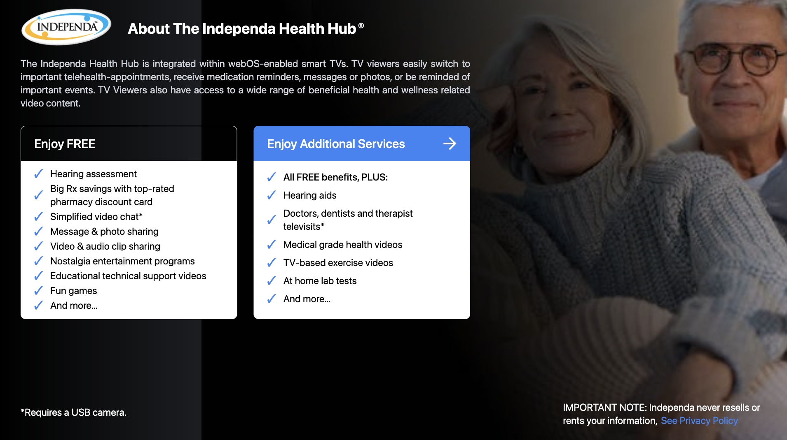
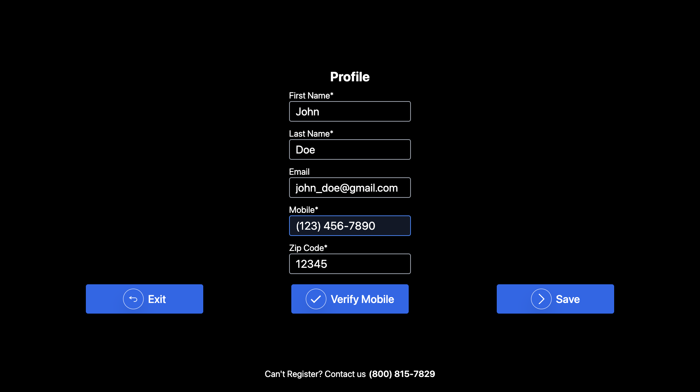
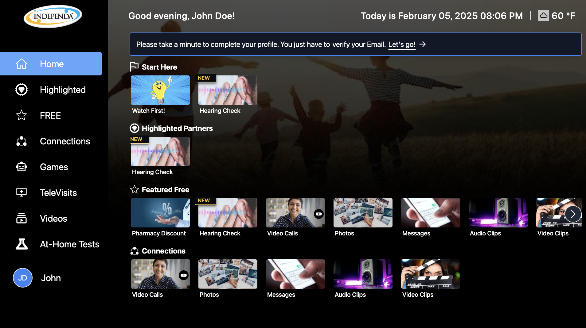

<!-- ---
title: Consumer
tags: [getting_started, formatting, content_types]
keywords: pages, authoring, exclusion, frontmatter
last_updated: July 16, 2016
summary: "This theme primarily uses pages. You need to make sure your pages have the appropriate frontmatter. One frontmatter tag your users might find helpful is the summary tag. This functions similar in purpose to the shortdesc element in DITA."
sidebar: mydoc_sidebar
permalink: mydoc_ihh_consumer.html
--- -->

## Independa

Stay Healthy & Well in your Home, Conveniently!

### 1. Visit Our Website

1. <a alt='health hub' href='https://independa.com/'>https://independa.com/</a>
2. Click on Health Hub and you'll be redirected to <a alt='health hub' href='https://tv.independa.com/'>Independa Health Hub</a>

### 2. Independa Health Hub Sign Up

1. Click on Learn More
2. Click on Enjoy Additional Services
3. Fill out the required fields
4. Verify your Mobile number and click on Save
5. All Done! Welcome to the Independa Health Hub!

## Where to author content
Use a text editor such as Sublime Text, WebStorm, IntelliJ, Visual Studio Code or Atom to create pages. Atom is recommended because it's created by Github, which is driving some of the Jekyll development through Github Pages.

